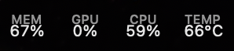
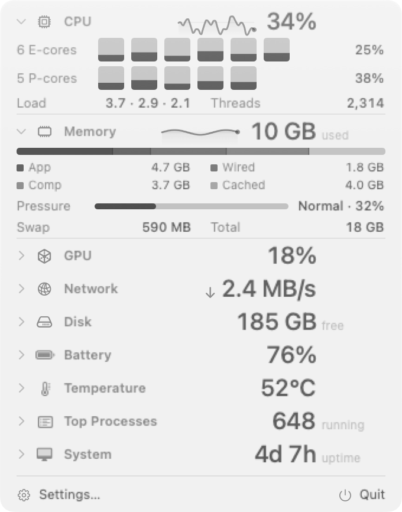

# AirStats

AirStats is a system monitor for the Mac menu bar. It reads CPU, memory, GPU, network,
disk, battery, temperature, process and host statistics from the kernel, then shows
them in three places: the menu bar itself, a panel that drops down when you click the
status item, and a floating overlay you can leave on your desktop.

It has no Dock icon. It reads the system through Mach, IOKit, sysctl and CoreWLAN.





## Install

[**Download AirStats**](https://github.com/byrencheema/airstats/releases/latest/download/AirStats.dmg),
open it, and drag the app to Applications. It is signed and notarized, so it opens with
no warning.

Or with Homebrew:

```sh
brew install --cask byrencheema/tap/airstats
```

Building from source is below if you would rather.

## Why it exists

Menu bar monitors are supposed to be background software, and a lot of them are not.
On a MacBook Pro (M3 Pro, macOS 26.5.2), sampled with one `top -l 2` run per interval
across 160 paired samples:

| App | Mean CPU | Memory | Threads |
| --- | --- | --- | --- |
| AirStats | 0.046% | 11.0 MB | 5 |
| iStat Menus (suite) | 0.116% | 64.0 MB | 11 |
| Stats 3.0.9 | 1.931% | 144.8 MB | 15 |

That 11 MB is a cold instance whose panel has never been opened. A warm one, after the
panel and settings have drawn, sits near 70 MB and does not give it back. Both numbers
are in the [full write-up][benchmark], along with the accuracy checks: every collector was probed
against an independent kernel source (`vm_stat`, `sysctl`, `netstat -ib`, `ioreg`,
`pmset`) and matched on 48 of 48 checks.

`vm_stat`, `sysctl`, `netstat -ib`, `ioreg` and `pmset` each get their own note in the
[blog][blog], along with why a GPU can read 98% idle and still be busy.

Do not take the table on faith. `Scripts/benchmark.py` runs the measurement behind it:

```sh
uv run Scripts/benchmark.py --samples 160
```

It samples every monitor running on your Mac through a single `top` invocation per
interval, so they share one measuring window, and discards `top`'s first sample because
it reports CPU since launch rather than over the interval. Your figures will not be
these figures, since they depend on the machine and on what else it is doing. The
ranking is the part that should reproduce.

[benchmark]: https://airstats.app/blog/airstat-vs-stats-vs-istat-menus
[blog]: https://airstats.app/blog

## Requirements

- macOS 14 or later
- Swift 6 toolchain (Xcode 16)
- Apple Silicon or Intel

## Build from source

```sh
Scripts/build.sh release
cp -R .build/arm64-apple-macosx/release/AirStats.app /Applications/
open /Applications/AirStats.app
```

`Scripts/build.sh` wraps the SwiftPM binary in a `.app` bundle and signs it ad hoc.
macOS grants a status item only to a signed bundle with `LSUIElement` set. Run the
script with no argument for a debug build.

An ad-hoc signature is enough to run a build you made yourself, and not enough to
travel: macOS refuses an ad-hoc bundle that arrived over the internet. `Scripts/release.sh`
is what produces the download above, signing with a Developer ID certificate and
stapling Apple's notarization ticket to the `.dmg`.

## Verify it without a screen

The binary samples collectors and draws its own UI offscreen.

```sh
swift test                                  # 180 tests, some of which read real sensors
.build/debug/AirStats --probe cpu --repeat 5 # sample a collector and print what it got
.build/debug/AirStats --render panel --dark  # write PNGs of a surface to ./render
.build/debug/AirStats --help
```

`--probe` prints raw collector output so you can diff it against `top`, `vm_stat`,
`netstat -ib`, `ioreg` and `pmset`. `--render` draws the menu bar, panel, overlay and
settings from fixture data at both appearances and both backing scales.

`NSVisualEffectView` draws nothing offscreen, so a render cannot judge a material or a
translucency. The collector contract tests read live sensors, so the fan test can flake
for a second during spin-down.

## Source layout

| Path | What lives there |
| --- | --- |
| `Sources/AirStatKit` | Collectors, the sampling engine, settings, formatting. No UI. |
| `Sources/AirStatUI` | Menu bar drawing, panel, overlay, settings window, charts, design system. |
| `Sources/AirStats` | The executable, app delegate, and the probe and render commands. |
| `Tests/AirStatKitTests` | Contract tests for the collectors, plus settings and formatting. |
| `Scripts/build.sh` | Builds the binary and assembles the `.app`. |
| `Scripts/release.sh` | Signs, notarizes and packages the `.dmg` that ships. |
| `Scripts/benchmark.py` | Samples the menu bar monitors on your Mac over one shared window. |

`AirStatKit` never imports SwiftUI or AppKit, which is what lets the tests and the probe
run in a windowless process.

## Contributing

[CONTRIBUTING.md](CONTRIBUTING.md) has the checks to run before a pull request and the
house rules. [CLAUDE.md](CLAUDE.md) records platform behaviour that is expensive to
rediscover, such as the stale objects an incremental SwiftPM build can link.

## License

MIT. See [LICENSE](LICENSE).
